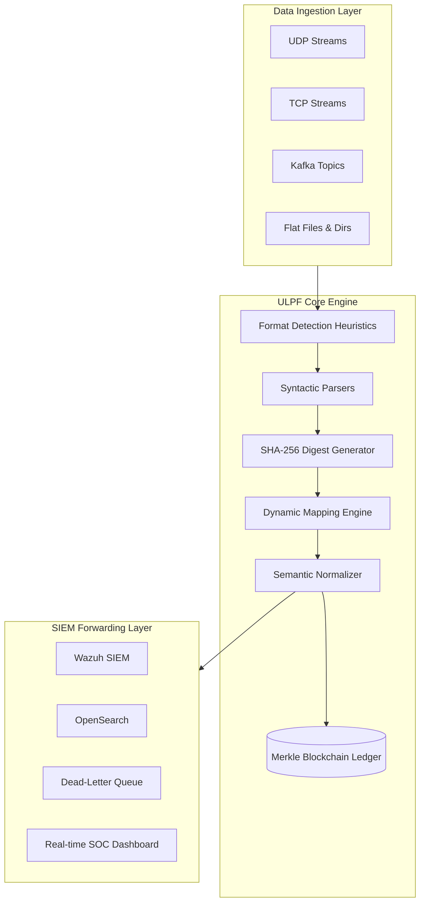

<div align="center">
  
  
  
  
  
</div>

<br>

<h1 align="center">Universal Log Pre-processing Framework (ULPF)</h1>

<p align="center">
  <b>Enterprise-Grade, Offline-Capable, Cryptographically Secure Log Normalization Engine</b><br>
  Developed for the National Technical Research Organisation (NTRO) under Smart India Hackathon (SIH) 2026.
</p>

---

## Executive Summary

Modern cybersecurity defense environments ingest telemetry from disparate vendors, including firewalls, routers, IDS/IPS appliances, proxies, and endpoint security agents. These devices generate logs in heterogeneous syntaxes (JSON, CSV, Syslog, CEF, LEEF, XML, Key-Value) with inconsistent proprietary field naming (`src_ip` vs `sourceAddress` vs `client_ip`).

> [!IMPORTANT]
> **ULPF Architecture Role**  
> ULPF is not a SIEM; it is the high-throughput preprocessing, integrity-locking, and standardization layer positioned upstream of SIEM platforms (such as Wazuh, OpenSearch, or Splunk). It ingests raw logs, verifies cryptographic integrity, neutralizes format anomalies, normalizes semantics into a uniform **Universal Event Schema**, and forwards them securely.

---

## Deliverables and Documentation Index for Evaluators

For evaluation of **Problem Statement 26156 (NTRO)**, all required deliverables and documentation are accessible at the following paths:

| Deliverable / Artifact | Location in Archive | Description |
| :--- | :--- | :--- |
| **Architecture Document (2 Pages)** | [`docs/architecture.md`](docs/architecture.md) | Official 2-page system architecture specification: decoupled pipeline, high-level data flow diagram, cryptographic chain of custody, and security boundaries. |
| **Setup & Execution Guide** | [README.md #Quickstart](#quickstart-docker-compose) | Step-by-step instructions to execute the containerized stack via Docker Compose, launch the SOC dashboard, and stream telemetry. |
| **Universal Event Schema Specification** | [`docs/schema.md`](docs/schema.md) | Canonical JSON schema specification, taxonomy definition, and field dictionary. |
| **Air-Gapped Deployment Guide** | [`docs/air-gapped.md`](docs/air-gapped.md) | Guide for offline, zero-trust deployment with local GeoIP and asset enrichment. |
| **Plugin and Extensibility Guide** | [`docs/plugin-development.md`](docs/plugin-development.md) | Instructions on developing and hot-reloading custom vendor parsers and declarative YAML mappings. |
| **Test Suite and Quality Report** | [`docs/testing.md`](docs/testing.md) and [`tests/`](tests/) | Automated test documentation (66/66 test suites passing). |
| **Interactive Workflow Diagrams** | [`docs/ulpf_workflow_diagram.html`](docs/ulpf_workflow_diagram.html) | High-resolution interactive visual architecture diagrams. |
| **Sample Perimeter Logs** | [`demo_logs_for_upload/`](demo_logs_for_upload/) and [`test_data/`](test_data/) | Multi-vendor sample logs (CEF, Syslog, JSON, NDJSON, CSV, LEEF, XML). |

---

## Repository Directory Structure

```text
ULPF/
├── app/                      # Core processing pipeline, parsers, normalizers, blockchain ledger, API and dashboard
│   ├── api/                  # FastAPI REST endpoints and stream controller
│   ├── core/                 # Pipeline engine, format sniffer, anomaly detector, SIEM forwarder
│   ├── enrichment/           # Offline GeoIP and local asset enrichers
│   ├── integrity/            # SHA-256 digest engine and Merkle DAG Blockchain Ledger
│   ├── mapping/              # 6-tier hybrid semantic mapping engine
│   ├── models/               # Universal Event schema and error models (Pydantic)
│   ├── normalization/        # Timestamp (UTC), IP/Port, action, and severity normalizers
│   ├── parsers/              # Syntactic sniffers (Syslog, CEF, LEEF, JSON, NDJSON, CSV, XML, Text)
│   ├── plugins/              # Dynamic plugin loader and interface
│   ├── storage/              # SQLite queryable storage, error DLQ, and SIEM adapters
│   └── templates/            # Professional dark-themed SOC Web Dashboard
├── configs/                  # Declarative vendor mappings (YAML), threat intel, and local GeoIP fixtures
├── demo_logs_for_upload/     # Sample logs ready for evaluation upload via Dashboard
├── docs/                     # Technical documentation and evaluation deliverables
│   ├── architecture.md       # Official 2-Page Architecture Document
│   ├── air-gapped.md         # Air-gapped and offline deployment guide
│   ├── deployment.md         # Production deployment instructions
│   ├── plugin-development.md # Vendor onboarding and plugin guide
│   ├── schema.md             # Universal Event Schema specification
│   ├── testing.md            # Test suite documentation
│   └── ulpf_workflow_diagram.* # Interactive visual system diagrams
├── plugins/                  # Hot-reloading vendor plugin extensions
├── scripts/                  # Stream simulator, benchmark scripts, and CLI utilities
├── test_data/                # Raw multi-format log fixtures (Syslog, CEF, LEEF, XML)
├── tests/                    # 66 comprehensive automated test suites (100% pass)
├── wazuh/ & wazuh-docker/    # Wazuh SIEM container integration, decoders, and rules
├── docker-compose.yml        # Full-stack orchestration (API, Dashboard, Listeners, SIEM)
├── Dockerfile                # Production multi-stage container build definition
├── requirements.txt          # Python dependencies
└── README.md                 # Setup, architecture summary, and evaluator index
```

---

## Key Architectural Innovations

| Feature | Description |
| :--- | :--- |
| **Cryptographic Chain of Custody** | Deterministic SHA-256 hashing per raw log event, sealed into an offline, append-only **Merkle DAG Blockchain Ledger**. Detects and isolates tamper attempts. |
| **Multi-Format Syntactic Parsers** | Native sniffers and parsers for **JSON, NDJSON, CSV, Syslog (RFC 3164/5424), ArcSight CEF, IBM QRadar LEEF 1.0/2.0, XML, and Key-Value Text**. |
| **Semantic Normalization Engine** | Converts timestamps to ISO 8601 UTC, validates IP/Port boundaries, standardizes network actions (`allow`, `deny`), and maps custom severities to a 5-tier standard. |
| **Built-in Anomaly and Rate Detector** | Statistical Z-Score tracking to flag volumetric spikes, unexpected null fields, and format structure deviations. |
| **Dynamic Plug-and-Play Extensibility** | Custom vendor parsers added to `plugins/` hot-reload dynamically without requiring framework restarts or codebase modification. |
| **Real-Time SOC Dashboard** | Dark-themed web dashboard for real-time visualization, Merkle tree audits, and anomaly monitoring. |
| **Air-Gapped and Offline Ready** | Zero external cloud API dependencies. Runs securely in restricted offline environments via Docker. |

---

## System Architecture

The ULPF architecture is designed as a concurrent pipeline, capable of processing logs from streaming network ports, Kafka topics, or flat files.



---

## Universal Event Schema (v1.0)

Every event normalized by ULPF adheres to a strict, standardized JSON schema ensuring zero data loss and downstream SIEM compatibility.

```json
{
  "event_id": "ULPF-8a92f1b4c3e2",
  "schema_version": "1.0",
  "event": {
    "timestamp": "2026-09-02T17:30:15Z",
    "type": "network",
    "category": "firewall",
    "action": "deny",
    "severity": "medium"
  },
  "source": { "ip": "192.168.1.20", "port": 54321 },
  "destination": { "ip": "10.0.0.5", "port": 443 },
  "device": { "vendor": "VendorA", "product": "FirewallA" },
  "metadata": {
    "parser": "json",
    "raw_event_hash": "c5f118835f8d68e...64chars",
    "processing_time_ms": 0.182
  },
  "raw": {
    "data": "{\"src_ip\":\"192.168.1.20\",\"dst_ip\":\"10.0.0.5\",\"action\":\"DENY\"}",
    "format": "json"
  }
}
```

---

## Quickstart: Docker Compose

The easiest way to execute the entire ULPF stack, including the API, Dashboard, and background ingestion workers, is via Docker.

### 1. Build and Start the Stack
```powershell
docker-compose up -d --build
```

### 2. Access the Infrastructure
- **SOC Web Dashboard**: [http://localhost:8000/dashboard](http://localhost:8000/dashboard)
- **API Swagger Documentation**: [http://localhost:8000/docs](http://localhost:8000/docs)
- **Wazuh SIEM Console**: [https://localhost:8443](https://localhost:8443) (If started via `wazuh-docker/`)

### 3. Stream Live Telemetry (Simulate)
Start the UDP listener via the API or Dashboard, then execute the event simulator:
```powershell
python scripts/stream_simulator.py --protocol udp --port 5140 --count 1000 --rate 250
```

---

## Advanced CLI Operations

For offline usage or batch processing without Docker, you can invoke the ULPF Core directly via Python 3.12+.

> [!NOTE]
> Install dependencies first: `pip install -r requirements.txt`

| Task | Command |
| :--- | :--- |
| **Ingest Log File** | `python -m app.main process test_data/syslog/system_auth.log` |
| **Detect Formats** | `python -m app.main detect test_data/` |
| **Audit Blockchain**| `python -m app.main audit-chain` |
| **Verify Hashes** | `python -m app.main verify-hash output/universal_events.jsonl` |
| **Run Benchmarks** | `python -m app.main benchmark --count 5000 --format all` |

---

## Automated Testing and Verification

ULPF features a comprehensive `pytest` suite ensuring pipeline stability, edge-case handling, and cryptographic hash verification.

```powershell
python -m pytest
```

```text
============================= test session starts =============================
platform win32 -- Python 3.12.10, pytest-8.4.2
collected 66 items

tests\api\test_blockchain_api.py .....                                   [  7%]
tests\api\test_dashboard_api.py ....                                     [ 13%]
tests\integration\test_edge_cases.py .................                   [ 39%]
tests\integration\test_parallel_processing.py .                          [ 40%]
tests\integration\test_pipeline_e2e.py .                                 [ 42%]
tests\integration\test_siem_forwarder.py ...                             [ 46%]
tests\integrity\test_blockchain.py ....                                  [ 53%]
tests\integrity\test_hashing.py ....                                     [ 59%]
tests\mapping\test_mapping_engine.py ...                                 [ 63%]
tests\normalization\test_normalization.py ......                         [ 72%]
tests\parsers\test_all_parsers.py ..........                             [ 87%]
tests\plugins\test_plugins.py .                                          [ 89%]
tests\test_stream_listeners.py ...                                       [ 93%]
tests\validation\test_validation.py ....                                 [100%]

======================= 66 passed in 7.74s ====================================
```

---

## License and Compliance

Developed under the MIT License for the Smart India Hackathon. Fully compliant with enterprise air-gapped security requirements. Zero telemetry is collected or transmitted externally.
