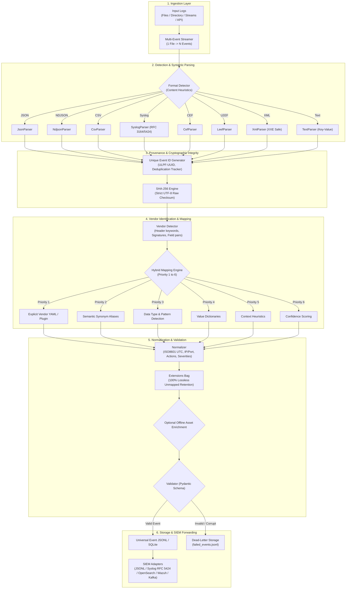

# Universal Log Pre-processing Framework (ULPF) — Architecture Document

## 1. System Mission & Context

### Problem Statement: 26156 (NTRO) — SIH 2026
**Theme**: Blockchain & Cybersecurity  
**Organization**: National Technical Research Organisation (NTRO)  
**Role**: Preprocessing, standardization, integrity verification, and enrichment layer for heterogeneous log telemetry.

> **CRITICAL ARCHITECTURAL BOUNDARY**:  
> **ULPF IS NOT A SIEM.**  
> ULPF does not implement alert rule correlation, SIEM storage indexing, or incident dashboards.  
> ULPF is the upstream **data engineering and integrity layer** that transforms raw, messy, incompatible multi-vendor logs into validated Universal Events before forwarding them to downstream SIEMs (e.g. Wazuh, Splunk, Elastic/OpenSearch).

---

## 2. The "Universal" Philosophy

Instead of attempting "one magical parser that understands every vendor", ULPF enforces a decoupled, modular pipeline:

```
[ Generic Format Parser ]  +  [ Vendor Field Mapping ]  +  [ Semantic Normalization ]
                            ↓
             [ Universal Schema JSON Output ]
```

- **A new vendor using JSON does NOT require a new JSON parser.** The existing generic JSON parser extracts the raw keys; a lightweight YAML mapping or dynamic plugin translates vendor-specific keys to canonical fields.
- **A new log format (e.g. Protocol Buffers, Avro) only requires a new format parser.** The downstream vendor mappings and normalization engines remain unchanged.

---

## 3. High-Level Data Flow Diagram



---

## 4. Traceability & Provenance Model

Traceability is preserved across every layer:

```
[ Input File: firewall.log ]
         │
         ├── Event 1 (Line 1) ──> [ Event ID: ULPF-8a92f1 ] ──> SHA-256: e3b0c44298... ──> Universal Event 1
         ├── Event 2 (Line 2) ──> [ Event ID: ULPF-9b03e2 ] ──> SHA-256: d41d8cd98f... ──> Universal Event 2
         └── Event 3 (Line 3) ──> [ Event ID: ULPF-7c12a4 ] ──> SHA-256: 7d8f99a12c... ──> Universal Event 3
```

Every `UniversalEvent` includes:
- `event_id`: Unique identifier per event.
- `metadata.source_file`: Origin file path.
- `metadata.source_line`: Line index in source file.
- `metadata.parser`: Format parser that extracted the syntax.
- `metadata.raw_event_hash`: Cryptographic SHA-256 digest of `raw.data`.
- `raw.data`: Exact unmodified original raw event string.
- `raw.format`: Detected format identifier.

---

## 5. Security & Isolation Controls

1. **Path Traversal Protection**: Inputs are verified and sanitized before filesystem access.
2. **XML Entity Resolution Disabled**: `XmlParser` disables DTD entity expansion, preventing Billion Laughs and external entity (XXE) attacks.
3. **Buffer & Memory DOS Prevention**:
   - Max file size ceiling: `100 MB` (configurable).
   - Max single line ceiling: `64 KB`.
4. **No Unsafe Execution (`eval` / `exec`)**: Log text is strictly treated as data; dynamic Python code execution is completely prohibited on event content.
5. **Sandboxed Plugin Discovery**: Plugins must explicitly inherit from `PluginInterface` and undergo type inspection before registration into the active pipeline.
